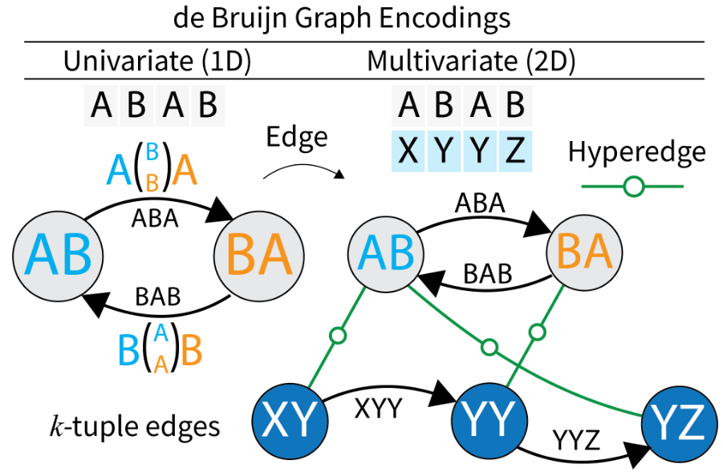
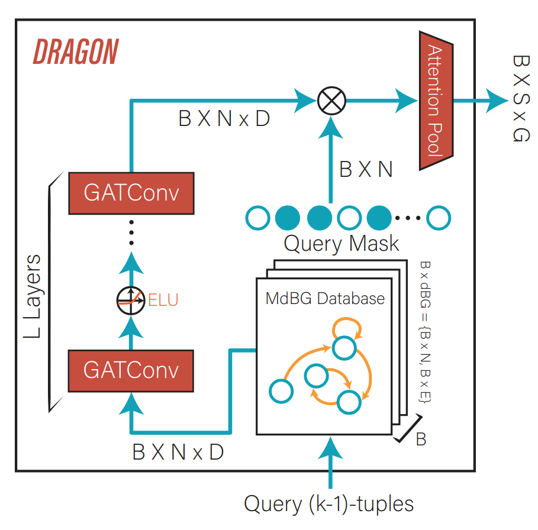

# MultdBG-Time-Series-Library
This repository contains the official implementation of:

### 📄 [**Multivariate de Bruijn Graphs: A Symbolic Graph Framework for Time Series Forecasting**](https://arxiv.org/abs/2505.22768)

Presented at the **[ICML 2025 Workshop on Structured Foundation Models](https://icml-structured-fm-workshop.github.io/)**


## Overview

**DRAGON** (Discrete Representation and Augmented Graph encoding Over de BruijN graphs) is a symbolic encoder that enhances time series forecasting models by incorporating graph-based representations derived from symbolic discretization.

<div style="display: flex; justify-content: center; gap: 20px;">
  
  
</div>


### Key Components

* **Multivariate de Bruijn Graph (MdBG):** Captures intra- and inter-dimensional motifs across time series using symbolic k-tuples.
* **DRAGON Module:** A plug-and-play encoder that learns global structural patterns using graph attention and diffusion over MdBGs.
* **Dual-Branch Architecture:** Combines DRAGON with a standard encoder (e.g., CNN) to improve temporal modeling under constrained input.

## Features

* Generalizable symbolic representation via discretization
* Global graph context encoding using Graph Attention Convolution
* Compatible with TimesNet and other forecasting backbones
* Outperforms SoTA on ETT datasets in low-context settings


## Running
This repository builds upon the [TSLib](https://github.com/thuml/Time-Series-Library) framework. For details regarding environment setup and baseline implementations, please refer to the original TSLib repository.

All components related to the Multivariate de Bruijn Graph (MdBG) and the DRAGON encoder are located in the `dbG/` directory.

To reproduce the results presented in our paper, execute the scripts located under `runscripts/runscripts/slurm_jobs/`.


## Citation

Please cite our work if you use this code:

```bibtex
@misc{cakiroglu2025dragon,
      title={Multivariate de Bruijn Graphs: A Symbolic Graph Framework for Time Series Forecasting}, 
      author={Mert Onur Cakiroglu and Idil Bilge Altun and Hasan Kurban and Elham Buxton and Mehmet Dalkilic},
      year={2025},
      eprint={2505.22768},
      archivePrefix={arXiv},
      primaryClass={cs.LG},
      url={https://arxiv.org/abs/2505.22768}, 
}
```
